# Actividad Docker - DAD

### Alumna: Tiziana Yazmin Ochoa

### Materia: Diseño y Arquitectura de Despliegues

### Fecha: 05/05/2026

---

# Objetivo

Implementar los ejemplos del repositorio Docker Tutorial, realizando la construcción de imágenes, ejecución de contenedores, edición de archivos dentro de Docker y conexión desde Visual Studio Code. El desarrollo de todos los ejemplos se encuentran en este Readme.

Repositorio utilizado:

https://github.com/joseluisgs/docker-tutorial

---

# Ejemplo 01 - Edición dentro del contenedor Docker

## Construcción de la imagen

Se construyó la imagen Docker utilizando el archivo Dockerfile del proyecto.

Comando utilizado:

```bash
docker build -t ejem01 .
```

### Captura 1 - Construcción de la imagen

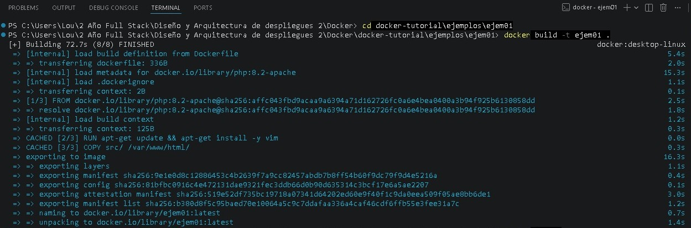

---

## Verificación de la imagen creada

Se verificó que la imagen estuviera disponible localmente.

Comando utilizado:

```bash
docker images
```

### Captura 2 - Imagen creada

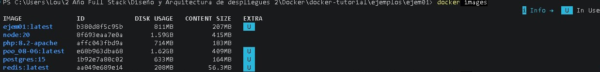

---

## Ejecución del contenedor

Se ejecutó el contenedor asociado a la imagen creada.

Comando utilizado:

```bash
docker ps
```

### Captura 3 - Contenedor en ejecución

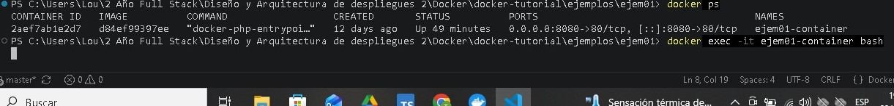

---

## Acceso al contenedor

Se ingresó al contenedor para trabajar directamente sobre el sistema Linux interno.

Comando utilizado:

```bash
docker exec -it ejem01-container bash
```

## Edición del archivo index.html

Se editó el archivo index.html para agregar información personal solicitada por la actividad.

Comando utilizado:

```bash
vi index.html
```

Contenido agregado:

* Nombre: Tiziana Yazmin Ochoa
* Fecha: 05/05/2026
* Materia: Diseño y Arquitectura de Despliegues

### Captura 5 - Edición del archivo

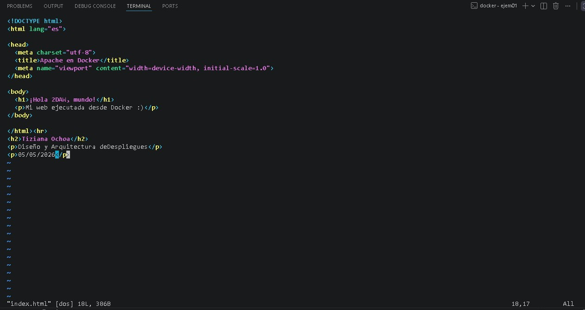

---
## Instalación y verificación de Vim

Una vez dentro del contenedor, se instaló el editor de texto Vim para poder editar archivos desde la terminal Linux.

Comandos utilizados:

```bash
apt-get update
apt-get install -y vim
```

Posteriormente se verificó la correcta instalación mediante:

```
vim --version
```

### Captura 6 - Version de Vim

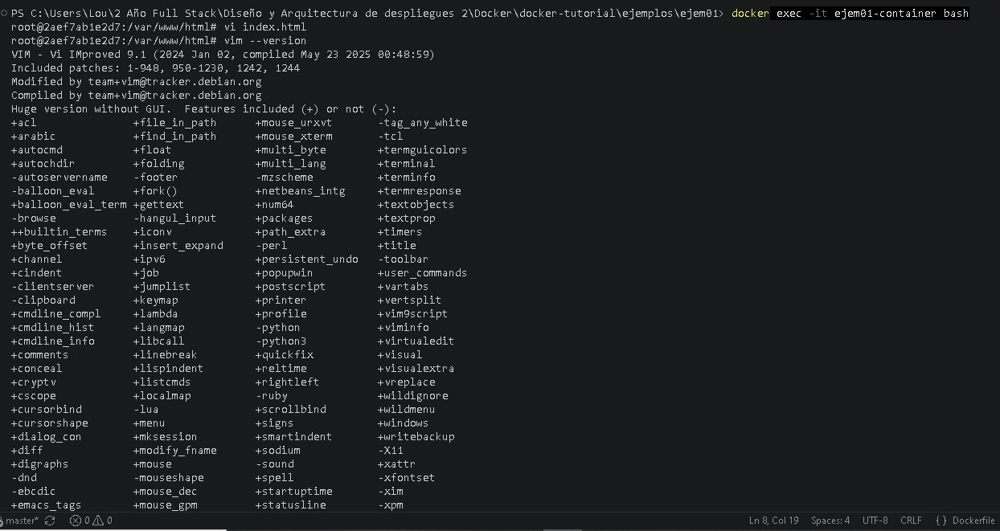
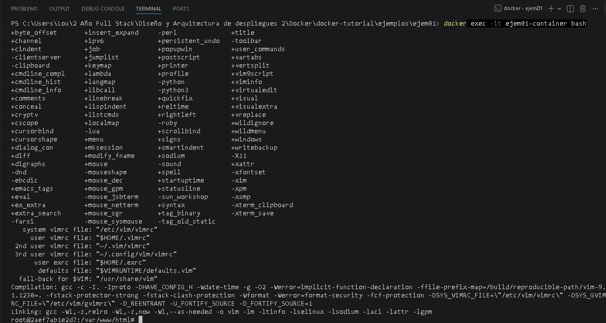

---
## Resultado Final

Se verificó el correcto funcionamiento accediendo desde el navegador al servicio publicado por Docker.

URL utilizada:

```text
http://localhost:8080
```

### Captura 7 - Página funcionando

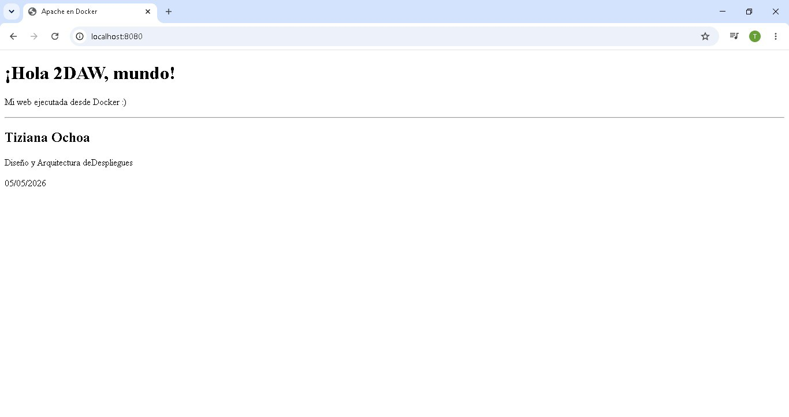

---

## Conexión desde Visual Studio Code

Se instaló la extensión Remote Explorer para conectarse al contenedor Docker desde Visual Studio Code.

### Captura 8 - VS Code conectado al contenedor

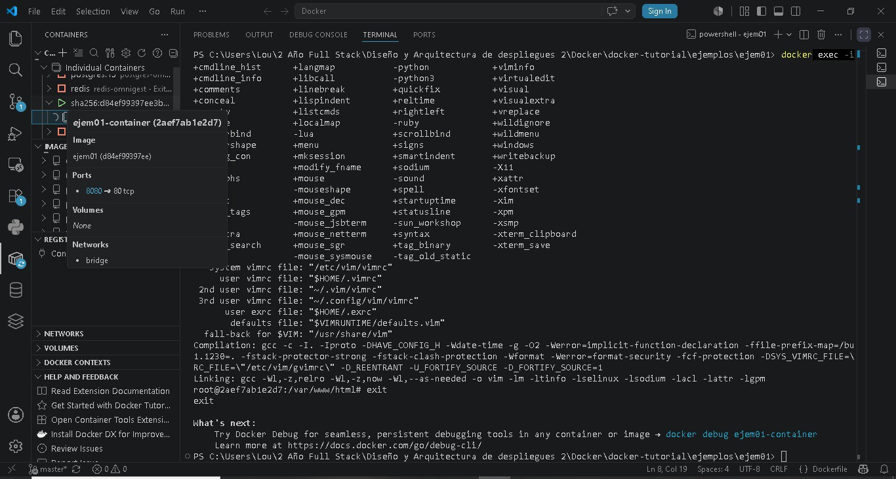

---

# Ejemplo 02 - Despliegue de WordPress y MariaDB

## Análisis del archivo run.sh

Se analizó el contenido del archivo `run.sh`, el cual automatiza la creación de dos contenedores Docker:

- Un contenedor de base de datos MariaDB.
- Un contenedor WordPress conectado a la base de datos.

### Captura 1 - Contenido de run.sh

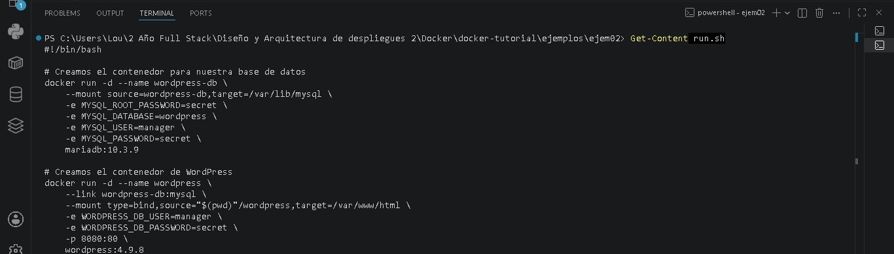

---

## Creación manual del contenedor de base de datos

En lugar de ejecutar el script completo, se ejecutaron manualmente los comandos desde la terminal de Visual Studio Code.

Comando utilizado:

```bash
docker run -d --name wordpress-db --mount source=wordpress-db,target=/var/lib/mysql -e MYSQL_ROOT_PASSWORD=secret -e MYSQL_DATABASE=wordpress -e MYSQL_USER=manager -e MYSQL_PASSWORD=secret mariadb:10.3.9
```

Este contenedor almacena la base de datos utilizada por WordPress.

## Captura 2 - Creación del contenedor MariaDB

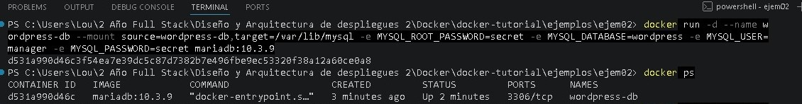

---
## Creación manual del contenedor WordPress

Posteriormente se creó el contenedor WordPress y se lo vinculó con la base de datos creada anteriormente.

Comando utilizado:

```bash
docker run -d --name wordpress --link wordpress-db:mysql --mount type=bind,source="${PWD}\wordpress",target=/var/www/html -e WORDPRESS_DB_USER=manager -e WORDPRESS_DB_PASSWORD=secret -p 8081:80 wordpress:4.9.8
```

## Captura 3 - Creación del contenedor WordPress

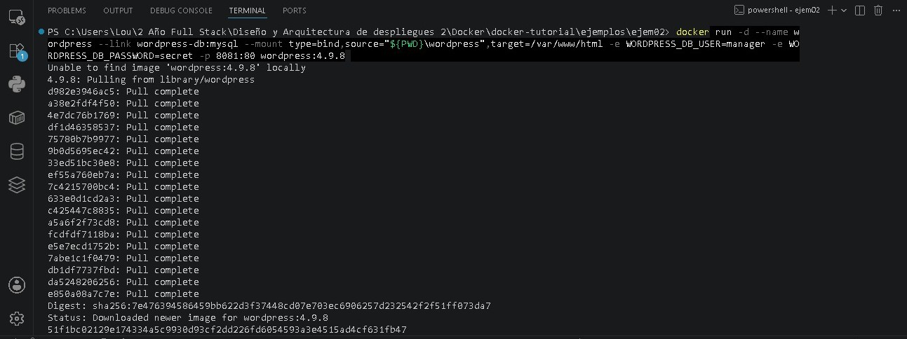

---
## Verificación del despliegue

Se verificó que ambos contenedores estuvieran ejecutándose correctamente.

Comando utilizado:

```bash
docker ps
```

## Captura 4 - Contenedores en ejecución

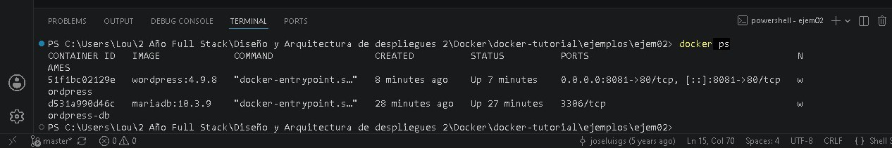

---
## Resultado final

Finalmente se accedió desde el navegador al servicio WordPress desplegado mediante Docker.

URL utilizada:

http://localhost:8081

## Captura 5 - WordPress funcionando

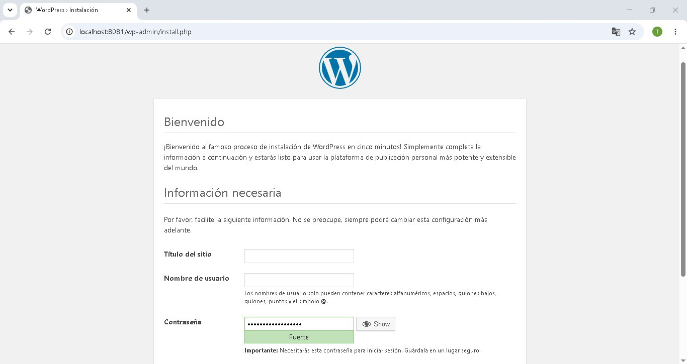


---
## Conclusión

Se interpretó el funcionamiento del script run.sh, se ejecutaron manualmente todos sus comandos desde la terminal de Visual Studio Code y se verificó el correcto despliegue de los contenedores MariaDB y WordPress utilizando Docker.

---

# Ejemplo 03 - Redes Docker y ejecución de scripts Bash

## Objetivo

Ejecutar el script `run.sh` del ejemplo 03, analizar su funcionamiento y evaluar las ventajas y desventajas de utilizar scripts dependientes del sistema operativo.

---

## Análisis del archivo run.sh

Se analizó el contenido del script `run.sh`, el cual automatiza la creación de una infraestructura compuesta por:

* Una carpeta local para persistencia de archivos.
* Una red Docker personalizada.
* Un contenedor MariaDB para la base de datos.
* Un contenedor WordPress conectado a la misma red.

### Captura 1 - Contenido del script

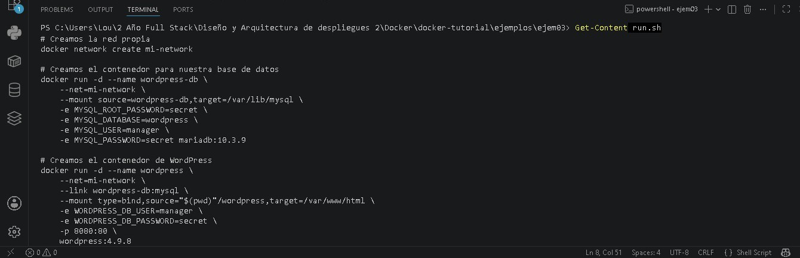

---

## Creación de la carpeta de trabajo

El script comienza creando una carpeta llamada `wordpress`, utilizada posteriormente como volumen compartido entre el sistema anfitrión y el contenedor WordPress.

Comando ejecutado:

```bash
mkdir wordpress
```

---

## Creación de una red Docker personalizada

Se creó una red propia para permitir la comunicación entre los contenedores de forma aislada.

Comando ejecutado:

```bash
docker network create my-network
```

### Captura 2 - Creación de la red

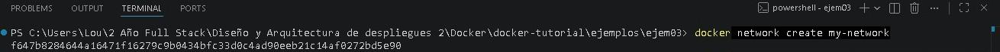

---

## Verificación de la red creada

Se verificó que la red estuviera disponible en Docker.

Comando ejecutado:

```bash
docker network ls
```

### Captura 3 - Verificación de la red

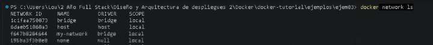

---

## Creación del contenedor WordPress

Se desplegó el contenedor WordPress conectado a la red personalizada.

Comando ejecutado:

```bash
docker run -d --name wordpress --net=my-network --link wordpress-db:mysql --mount type=bind,source="${PWD}\wordpress",target=/var/www/html -e WORDPRESS_DB_USER=manager -e WORDPRESS_DB_PASSWORD=secret -p 8082:80 wordpress:4.9.8
```

### Captura 4 - Contenedor WordPress

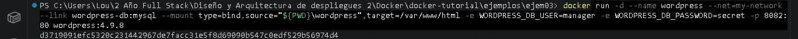

---

## Creación del contenedor MariaDB

Posteriormente se desplegó el contenedor de base de datos MariaDB.

Comando ejecutado:

```bash
docker run -d --name wordpress-db --net=my-network --mount source=wordpress-db,target=/var/lib/mysql -e MYSQL_ROOT_PASSWORD=secret -e MYSQL_DATABASE=wordpress -e MYSQL_USER=manager -e MYSQL_PASSWORD=secret mariadb:10.3.9
```

### Captura 5 - Contenedor MariaDB

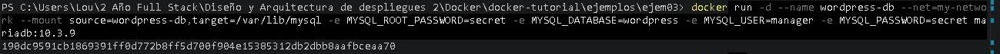

---

## Verificación del despliegue

Se comprobó que los contenedores se encontraran en ejecución mediante Docker.

Comando ejecutado:

```bash
docker ps
```

### Captura 6 - Contenedores en ejecución


---

## Resultado final

Se verificó el correcto funcionamiento del despliegue accediendo desde el navegador al servicio WordPress.

URL utilizada:

```text
http://localhost:8082
```

### Captura 7 - WordPress funcionando

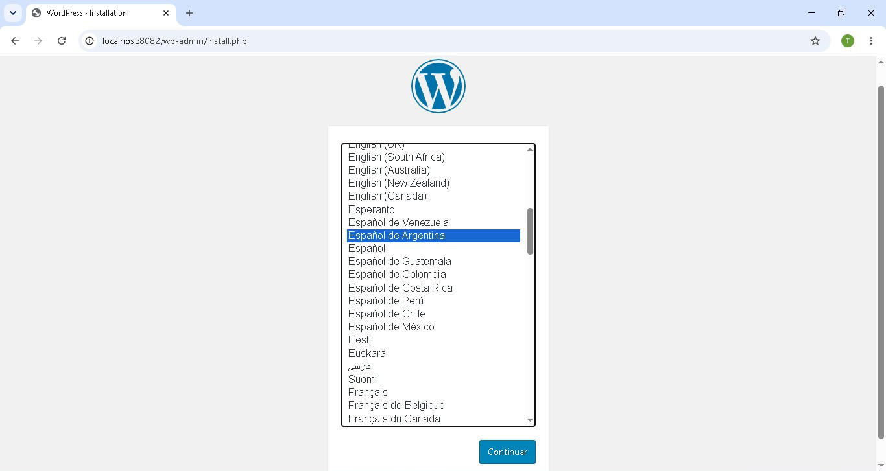

---

## Evaluación de los inconvenientes de los scripts de Sistema Operativo

Los scripts de sistema operativo permiten automatizar tareas repetitivas y simplificar procesos complejos. Sin embargo, presentan algunas limitaciones relacionadas con la portabilidad.

### Principales inconvenientes

* Dependencia del sistema operativo donde fueron creados.
* Diferencias entre Bash (Linux) y PowerShell (Windows).
* Cambios en rutas de archivos según el sistema.
* Posibles incompatibilidades entre versiones de herramientas como Docker.
* Mayor dificultad para reutilizar el mismo script en diferentes entornos.

### Conclusión

Los scripts de automatización son herramientas muy útiles para agilizar despliegues y configuraciones. No obstante, su portabilidad puede verse afectada cuando dependen de características específicas del sistema operativo. Durante esta práctica fue necesario adaptar algunos comandos al entorno Windows y verificar manualmente la configuración de red y contenedores para lograr un despliegue exitoso.

